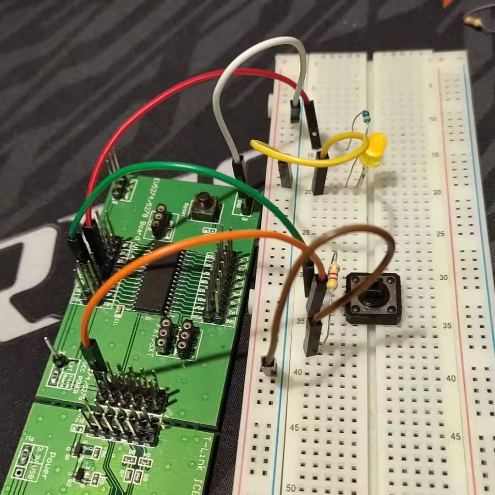

# TwoPortKeyContorlLED
A port use to get the key press input, another port use to LED output

# Wiring diagram
Pin 11 use to display the LED  
Pin 10 use to scan the key status 

# File Comment
## init.h
**File**: init.h  
**Brief**: System initialize head file

**Details**:  
- Declaration the SysInit() and VarsInit(), what is use to ensure systeam run normally 
- Define the necessary variable and data structure

## init.c
**File**: init.c  
**Brief**: System initialize source file

**Details**:
- Clear the watch dog peripheral, to ensure the  system could reset when program run unexpectedly
- Config GPIO peripheral. Set pin 10 to output
- No  variables need to initalize in this project

## includeAll.h
**File**: includeAll.h  
**Brief**: Include the project head file

## display.h
**File**: display.h  
**Brief**: Led control head file

**Details**:
- Define the led pin macro and const data macro
- Define the action macro use to control LED turn on or turn off
- Define the action macro use to reversal the LED status

## key.h
**File**: key.h  
**Brief**: Key control head file

**Details**:
- Define the key pin macro
- Define the key status macro

## key.c
**File**: key.c  
**Brief**: Key control source file

**Details**:
- Scanning the key status 
- Stable key press. Use raise edge to enter the *GetKeys()* first IF statement and fall edge update the key status

## mian.h
**File**: main.h  
**Brief**: project main head file

## main.c
**File**: main.c  
**Brief**: The project main source file

**Details**: 
- Once the key is pressed, the LED status will toggle 
- Get key status with 20 ms interval to eliminate key jitter 

# Attention

The file comment also write at git commit. Move you mouse over the file commit to see then. 